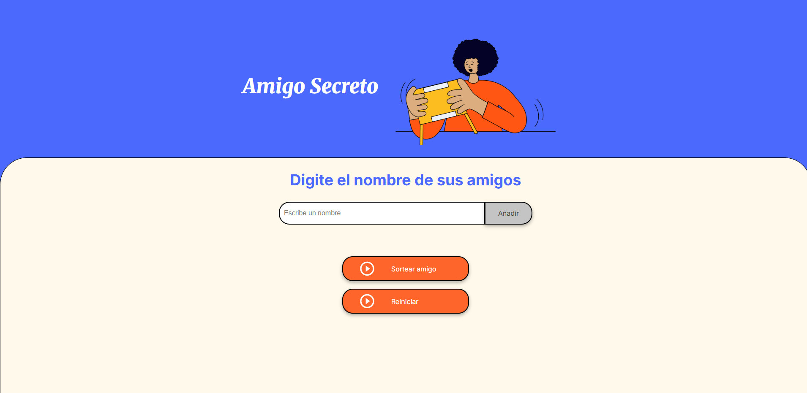
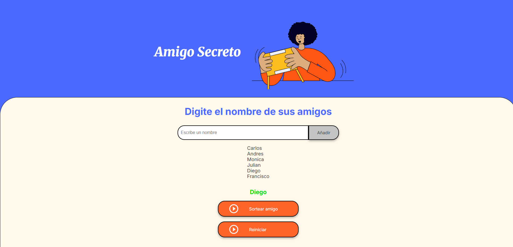

# Amigo Secreto - Aplicación Web

En este desafío, se desarrolló una aplicación que permite a los usuarios ingresar nombres de amigos en una lista para luego realizar un **sorteo aleatorio** y determinar quién es el "Amigo Secreto".

El proyecto fue realizado por **Carlos Fabián Mesa Muñoz**.

---

## Funcionalidades

- **Agregar nombres:** Los usuarios pueden escribir el nombre de un amigo en un campo de texto y agregarlo a una lista visible al hacer clic en **"Adicionar"**.  
- **Validar entrada:** Si el campo de texto está vacío, se mostrará una alerta solicitando un nombre válido.  
- **Visualizar la lista:** Los nombres ingresados aparecerán en una lista debajo del campo de entrada.  
- **Sorteo aleatorio:** Al hacer clic en **"Sortear Amigo"**, se seleccionará aleatoriamente un nombre de la lista y se mostrará en la página.  
- **Reiniciar programa:** Se incluye una funcionalidad para reiniciar la lista y comenzar de nuevo.

---

## Capturas de pantalla

Pantalla principal de la aplicación:

Resultado del sorteo:

---

## Tecnologías utilizadas

- HTML  
- CSS  
- JavaScript  

---

## Cómo usar la aplicación

1. Ingresa el nombre de un amigo en el campo de texto.  
2. Haz clic en **"Adicionar"** para agregarlo a la lista.  
3. Repite los pasos anteriores para todos los amigos que quieras incluir.  
4. Haz clic en **"Sortear Amigo"** para seleccionar aleatoriamente a un amigo.  
5. Para reiniciar la lista y comenzar de nuevo, utiliza el botón de **reinicio**.

---

## Autor

**Carlos Fabián Mesa Muñoz**
