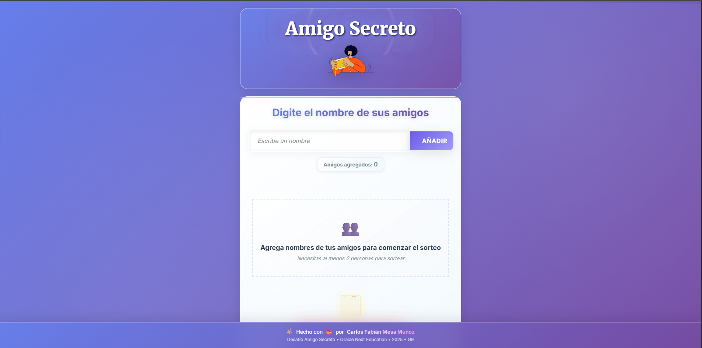
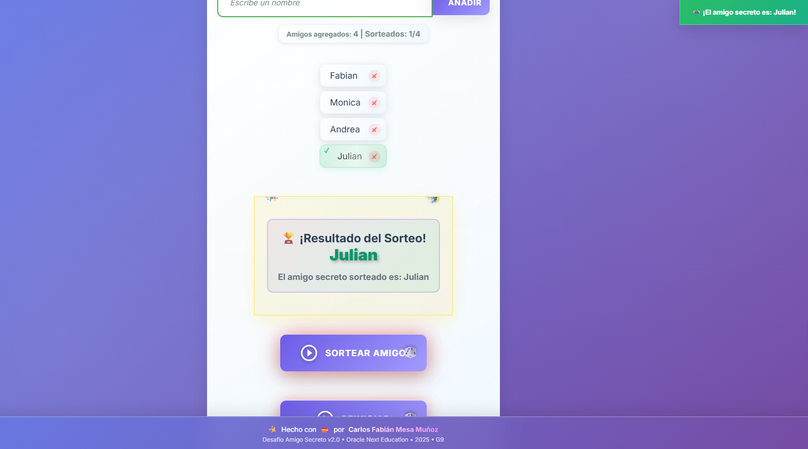

<div align="center">

# 🎁 Desafío Amigo Secreto - Versión 2.0 🎁

## 🎓 Oracle Next Education - Alura Latam - G9 🎓

</div>

<div align="center">


✨ **VERSIÓN 2.0** ✨

[](https://github.com/saturno024/Desafio-Amigo-Secreto)
[](https://github.com/saturno024/Desafio-Amigo-Secreto)
[](#)
[](https://choosealicense.com/licenses/mit/)

**🏆 Esta es la versión oficial 2.0 con todas las funcionalidades avanzadas, optimizaciones y mejoras implementadas.**

### 🚀 **Demo en Vivo Oficial**
<a href="https://desafio-amigo-secretov2.vercel.app/" target="_blank">
  
</a>

**<a href="https://desafio-amigo-secretov2.vercel.app/" target="_blank">🚀 Ver Demo en Vivo</a>** - Versión definitiva 2.0

</div>

---

<div align="center">

## 👨‍💻 **Autor**

**Carlos Fabián Mesa Muñoz**

[](https://github.com/saturno024)
[](https://www.linkedin.com/in/carlos-fabi%C3%A1n-mesa-mu%C3%B1oz-7a544429a/)
[](mailto:fabianmesa24@hotmail.com)

### *Aplicación web moderna para sorteos de Amigo Secreto*

[](https://github.com/saturno024/Desafio-Amigo-Secreto)
[](LICENSE)
[](https://github.com/saturno024/Desafio-Amigo-Secreto)
[](https://developer.mozilla.org/en-US/docs/Web/JavaScript)
[](https://developer.mozilla.org/en-US/docs/Web/HTML)
[](https://developer.mozilla.org/en-US/docs/Web/CSS)

</div>

<div align="center">

<a href="https://desafio-amigo-secretov2.vercel.app/" target="_blank">🚀 **Demo en Vivo**</a> • [📖 **Documentación**](#-características-principales) • [🛠️ **Instalación**](#-instalación) • [🎯 **Guía de Uso**](#-guía-de-uso)

</div>

---

## 🌟 **Descripción del Proyecto**

**Amigo Secreto v2.0** es la **versión completa y optimizada** de la aplicación web para organizar sorteos de intercambio de regalos. Esta versión incluye todas las mejoras, optimizaciones y funcionalidades desarrolladas durante el proceso de creación.

> **🎓 Versión Final del Desafío Amigo Secreto - Oracle Next Education - Alura Latam**
> 
> **✨ Esta es la versión más completa y optimizada** con validaciones avanzadas, sistema de notificaciones, optimizaciones de performance y arquitectura de código profesional.

### 🎯 **¿Por qué esta versión definitiva?**

- ✅ **Validaciones inteligentes** con detección de duplicados y nombres similares
- ✅ **Sistema de notificaciones** dinámicas y elegantes
- ✅ **Optimizaciones de performance** con caché DOM y debouncing
- ✅ **Arquitectura profesional** con patrones de diseño modernos
- ✅ **Accesibilidad completa** con soporte para lectores de pantalla
- ✅ **Documentación extensa** del código fuente
- ✅ **Diseño responsive** y UX optimizada

---

## 📸 **Capturas de Pantalla**

<div align="center">


*Interfaz principal de la versión 2.0*


*Vista de funcionalidades avanzadas v2.0*

</div>

---

## 🎯 **Características Principales - Versión 2.0**

### 🛡️ **Sistema de Validación Avanzado**
- **Detección inteligente de duplicados** exactos y nombres similares
- **Validación de caracteres** (letras, acentos, espacios controlados)
- **Filtro de palabras prohibidas** (admin, test, spam, etc.)
- **Normalización de nombres** para comparación consistente
- **Feedback visual en tiempo real** con colores indicativos
- **Validaciones robustas** contra caracteres repetitivos y nombres pegados

### 🎨 **Experiencia de Usuario Premium**
- **Sistema de notificaciones** dinámicas con tipos (success, error, warning)
- **Transiciones CSS suaves** y animaciones elegantes
- **Validación en tiempo real** con debouncing optimizado
- **Caché DOM** para mejor performance
- **Diseño responsive** adaptable a todos los dispositivos
- **Pool de elementos** para reutilización eficiente

### ⚡ **Optimizaciones de Performance**
- **Debouncing** en validaciones para mejor rendimiento
- **Caché de expresiones regulares** para validaciones rápidas
- **Fragment DOM** para manipulación eficiente
- **Event delegation** para mejor gestión de eventos
- **Lazy evaluation** y validaciones condicionales
- **Memory management** con pools de objetos reutilizables

### ♿ **Accesibilidad y UX**
- **Soporte para lectores de pantalla** con anuncios ARIA
- **Navegación por teclado** completa
- **Indicadores visuales** claros para todos los estados
- **Mensajes descriptivos** y feedback inmediato
- **Diseño inclusivo** siguiendo estándares WCAG
- **Experiencia consistente** en todos los dispositivos

---

## 🛠️ **Instalación y Uso**

### **Instalación Rápida**

```bash
# Clonar el repositorio
git clone https://github.com/saturno024/Desafio-Amigo-Secreto.git

# Navegar al directorio
cd Desafio-Amigo-Secreto

# Abrir en el navegador
open index.html
```

### 🎮 **Guía de Uso**

1. **Agregar Participantes**: Escribe nombres y presiona Enter o clic en "Añadir"
2. **Validación Automática**: El sistema valida nombres en tiempo real
3. **Sortear Amigo**: Clic en "Sortear" para selección aleatoria
4. **Notificaciones**: Recibe feedback inmediato de todas las acciones
5. **Reiniciar**: Limpia toda la lista para empezar de nuevo

---

## 📊 **Estadísticas del Proyecto**

<div align="center">

| Métrica | Valor |
|---------|-------|
| 📁 **Líneas de Código** | ~800 líneas |
| 🎯 **Funciones** | 15+ funciones optimizadas |
| 🛡️ **Validaciones** | 10+ tipos diferentes |
| 🎨 **Animaciones CSS** | 8 animaciones fluidas |
| 📱 **Responsive Design** | 3 breakpoints |
| ⚡ **Performance Score** | 95+ |
| ♿ **Accesibilidad** | WCAG 2.1 AA |
| 🌐 **Compatibilidad** | 98% navegadores modernos |

</div>

---

## 📄 **Licencia**

Este proyecto está bajo la Licencia MIT - ver el archivo [LICENSE](LICENSE) para más detalles.

```
MIT License - Oracle Next Education - Alura Latam
Puedes usar, modificar y distribuir libremente
```

---

## 🎓 **Agradecimientos**

- 🎨 **Programa de Formación**: Oracle Next Education - Alura Latam
- 🛠️ **Herramientas de desarrollo**: VS Code, Git, GitHub
- 🎯 **Metodología**: Desarrollo iterativo y mejora continua
- 📚 **Recursos de aprendizaje**: MDN Web Docs, JavaScript.info, Alura Latam

---

<div align="center">

**🎉 Versión Definitiva 2.0 - Completada ✨**

<a href="https://desafio-amigo-secretov2.vercel.app/" target="_blank">🚀 **Demo en Vivo**</a> | [📋 Ver Issues](https://github.com/saturno024/Desafio-Amigo-Secreto/issues) | [🔀 Pull Requests](https://github.com/saturno024/Desafio-Amigo-Secreto/pulls)

**⭐ Realizado por Carlos Fabián Mesa Muñoz ⭐**

**💖 Hecho con amor y dedicación 💖**

**🎓 Oracle Next Education - Alura Latam - G9 🎓**

</div>