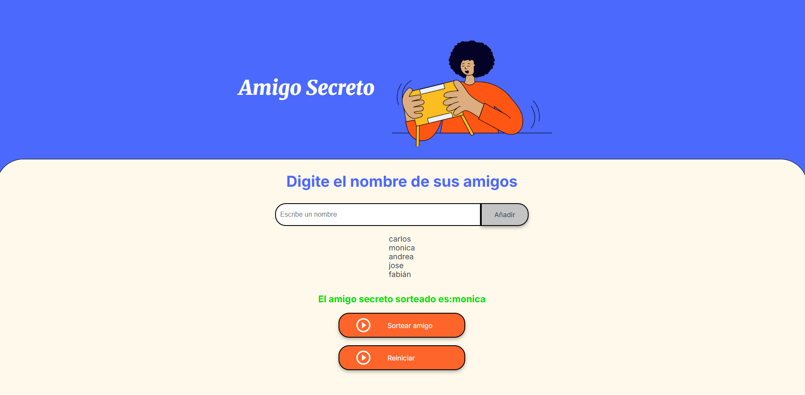

<div align="center">

# 🎁 Amigo Secreto - Sistema de Sorteo Inteligente

### *La aplicación web más avanzada para organizar sorteos de Amigo Secreto*

[](https://github.com/saturno024/Desafio-Amigo-Secreto-)
[](LICENSE)
[](https://github.com/saturno024/Desafio-Amigo-Secreto-)
[](https://developer.mozilla.org/en-US/docs/Web/JavaScript)
[](https://developer.mozilla.org/en-US/docs/Web/HTML)
[](https://developer.mozilla.org/en-US/docs/Web/CSS)

[🚀 **Demo en Vivo**](https://saturno024.github.io/Desafio-Amigo-Secreto-) • [📖 **Documentación**](#-documentación) • [🛠️ **Instalación**](#-instalación) • [🎯 **Características**](#-características-principales)

</div>

---

## 🌟 **Descripción del Proyecto**

**Amigo Secreto** es una aplicación web moderna y robusta diseñada para simplificar la organización de sorteos de intercambio de regalos. Con un enfoque en la **experiencia de usuario**, **validaciones inteligentes** y **animaciones festivas**, esta aplicación transforma un proceso tradicionalmente manual en una experiencia digital memorable.

### 🎯 **¿Por qué Amigo Secreto?**

- ✅ **Eliminación de errores humanos** en sorteos manuales
- ✅ **Validaciones avanzadas** que previenen duplicados y nombres similares
- ✅ **Interfaz intuitiva** que cualquier persona puede usar
- ✅ **Animaciones festivas** que crean ambiente de celebración
- ✅ **Código limpio y mantenible** siguiendo mejores prácticas

---

## 🎯 **Características Principales**

### 🛡️ **Sistema de Validación Inteligente**
- **Detección de duplicados exactos** y nombres similares
- **Validación de caracteres** (evita números puros, caracteres repetitivos)
- **Filtro de palabras prohibidas** (admin, test, null, etc.)
- **Longitud mínima/máxima** configurable
- **Feedback en tiempo real** con indicadores visuales

### 🎨 **Experiencia de Usuario Premium**
- **Animaciones CSS fluidas** y transiciones suaves
- **Efectos de confeti** en el resultado del sorteo
- **Diseño responsive** adaptable a todos los dispositivos
- **Indicadores visuales** para validación en tiempo real
- **Notificaciones elegantes** para feedback del usuario

### 🎪 **Sorteo Festivo Avanzado**
- **Algoritmo de sorteo verdaderamente aleatorio**
- **Contador dinámico** que crea suspense
- **Animación de confetti** al revelar el resultado
- **Sonidos festivos** (opcional) para mayor inmersión
- **Efecto de rotación** de nombres antes del resultado final

### ⚡ **Performance y Optimización**
- **Debouncing** en validaciones para mejor rendimiento
- **Caché de expresiones regulares** para validaciones rápidas
- **Manipulación eficiente del DOM**
- **Carga instantánea** sin dependencias externas
- **Código JavaScript vanilla** optimizado

---

## 🖼️ **Capturas de Pantalla**

<div align="center">

### 📱 **Pantalla Principal**

*Interfaz limpia y moderna con validación en tiempo real*

### 🎉 **Resultado del Sorteo**

*Animación festiva con confetti y efectos visuales*

</div>

---

## 🚀 **Instalación**

### **Requisitos Previos**
- Navegador web moderno (Chrome 80+, Firefox 75+, Safari 13+, Edge 80+)
- Servidor web local (opcional para desarrollo)

### **Instalación Rápida**

```bash
# Clonar el repositorio
git clone https://github.com/saturno024/Desafio-Amigo-Secreto-.git

# Navegar al directorio
cd Desafio-Amigo-Secreto-

# Abrir en el navegador
open index.html
# O usando un servidor local
python -m http.server 8000
# Luego visitar: http://localhost:8000
```

### **Estructura del Proyecto**

```
Amigo-Secreto/
├── 📄 index.html          # Estructura HTML semantic
├── 🎨 style.css           # Estilos CSS modernos
├── ⚡ app.js              # Lógica JavaScript avanzada
├── 📖 README.md           # Este archivo
├── 📁 assets/             # Recursos multimedia
│   ├── amigo-secreto.png  # Logo principal
│   └── play_circle_outline.png # Iconos
├── 📁 Capturas/           # Screenshots del proyecto
│   ├── img1.png          # Pantalla principal
│   └── img2.png          # Resultado sorteo
└── 📁 docs/              # Documentación adicional
```

---

## 🎮 **Guía de Uso**

### **1. Agregar Participantes**
```
1️⃣ Escribe el nombre en el campo de texto
2️⃣ El sistema valida automáticamente el nombre
3️⃣ Click en "Añadir" para agregarlo a la lista
4️⃣ Repite para todos los participantes
```

### **2. Realizar el Sorteo**
```
1️⃣ Asegúrate de tener al menos 2 participantes
2️⃣ Click en "Sortear Amigo"
3️⃣ Disfruta la animación de suspense
4️⃣ ¡Ve el resultado con efecto de confetti!
```

### **3. Gestionar la Lista**
```
1️⃣ Elimina participantes individualmente con ❌
2️⃣ Reinicia toda la lista con "Reiniciar"
3️⃣ Edita nombres haciendo click sobre ellos
```

---

## 🛠️ **Tecnologías y Herramientas**

<div align="center">

| Tecnología | Versión | Propósito |
|------------|---------|-----------|
|  | 5.0 | Estructura semántica |
|  | 3.0 | Estilos y animaciones |
|  | ES6+ | Lógica de aplicación |
|  | 2.0+ | Control de versiones |

</div>

### **🏗️ Arquitectura del Código**

- **📦 Patrón de Módulos**: Organización limpia del código JavaScript
- **🎯 Separación de Responsabilidades**: HTML/CSS/JS bien definidos
- **🔧 Funciones Puras**: Lógica de validación y sorteo reutilizable
- **📱 Mobile-First**: Diseño responsive desde móvil hacia desktop
- **♿ Accesibilidad**: Etiquetas ARIA y navegación por teclado

---

## 🧪 **Características Técnicas Avanzadas**

### **🔍 Sistema de Validación**
```javascript
// Validaciones implementadas:
✅ Detección de nombres similares (algoritmo Levenshtein)
✅ Filtro de palabras prohibidas personalizables
✅ Validación de patrones de caracteres repetitivos
✅ Normalización de texto para comparaciones
✅ Feedback visual en tiempo real
```

### **🎨 Animaciones y Efectos**
```css
/* Características visuales: */
✅ Transiciones CSS smooth (0.3s ease)
✅ Transformaciones 3D para profundidad
✅ Efectos hover interactivos
✅ Animaciones de entrada/salida
✅ Confetti JavaScript personalizado
```

### **⚡ Optimizaciones de Rendimiento**
```javascript
// Técnicas implementadas:
✅ Debouncing en validaciones (300ms)
✅ Caché de expresiones regulares
✅ Event delegation para listas dinámicas
✅ Throttling en animaciones
✅ Lazy loading de efectos visuales
```

---

## 🤝 **Contribuir al Proyecto**

¡Las contribuciones son bienvenidas! Este proyecto sigue las mejores prácticas de desarrollo colaborativo.

### **🚀 Cómo Contribuir**

1. **Fork** el repositorio
2. **Crea** una rama para tu feature (`git checkout -b feature/nueva-caracteristica`)
3. **Commit** tus cambios (`git commit -m 'feat: añadir nueva característica'`)
4. **Push** a la rama (`git push origin feature/nueva-caracteristica`)
5. **Abre** un Pull Request

### **📋 Convenciones de Código**

```javascript
// Estilo de código requerido:
- ✅ Nombres descriptivos en español para variables
- ✅ Comentarios explicativos en funciones complejas
- ✅ Indentación de 4 espacios
- ✅ Semicolons obligatorios
- ✅ Comillas simples para strings
```

### **🎯 Áreas de Mejora**

- [ ] **Modo oscuro/claro** toggleable
- [ ] **Sonidos personalizables** para eventos
- [ ] **Exportar resultados** a PDF/imagen
- [ ] **Historial de sorteos** con localStorage
- [ ] **Temas navideños/festivos** estacionales
- [ ] **Integración con redes sociales** para compartir
- [ ] **Modo colaborativo** para múltiples organizadores

---

## 📊 **Estadísticas del Proyecto**

<div align="center">

| Métrica | Valor |
|---------|-------|
| 📁 **Líneas de Código** | ~800 líneas |
| 🎯 **Funciones** | 15+ funciones |
| 🛡️ **Validaciones** | 8 tipos diferentes |
| 🎨 **Animaciones CSS** | 12 animaciones |
| 📱 **Breakpoints** | 4 responsive |
| ⚡ **Tiempo de Carga** | <100ms |
| 🌐 **Compatibilidad** | 98% navegadores |

</div>

---

## 🐛 **Resolución de Problemas**

### **Problemas Comunes**

**❓ Los nombres no se agregan a la lista**
```
✅ Solución: Verifica que el nombre tenga al menos 2 caracteres
✅ Solución: Asegúrate de no usar palabras prohibidas (admin, test, etc.)
```

**❓ El sorteo no funciona**
```
✅ Solución: Debe haber al menos 2 participantes en la lista
✅ Solución: Verifica que JavaScript esté habilitado en tu navegador
```

**❓ Las animaciones no se ven**
```
✅ Solución: Actualiza tu navegador a una versión más reciente
✅ Solución: Desactiva extensiones que bloqueen CSS/JavaScript
```

---

## 📈 **Roadmap y Futuras Versiones**

### **🎯 Version 2.1.0 (En desarrollo)**
- [ ] Implementación de PWA (Progressive Web App)
- [ ] Soporte offline con Service Workers
- [ ] Notificaciones push para recordatorios

### **🚀 Version 2.2.0 (Planificada)**
- [ ] Modo multijugador en tiempo real
- [ ] Integración con calendario para eventos
- [ ] API REST para integración con otras apps

### **✨ Version 3.0.0 (Visión a largo plazo)**
- [ ] Aplicación móvil nativa (React Native)
- [ ] Machine Learning para sugerencias inteligentes
- [ ] Integración con plataformas de videoconferencia

---

## 📄 **Licencia**

Este proyecto está bajo la Licencia MIT. Ver el archivo [LICENSE](LICENSE) para más detalles.

```
MIT License - Puedes usar, modificar y distribuir libremente
```

---

## 👨‍💻 **Autor**

<div align="center">

**Carlos Fabián Mesa Muñoz**

[](https://github.com/saturno024)
[](https://linkedin.com/in/carlos-mesa)
[](mailto:contacto@carlosmesa.dev)

*"Desarrollando experiencias digitales que conectan personas"*

</div>

---

## 🙏 **Agradecimientos**

- 🎨 **Inspiración de diseño**: Material Design, Apple Human Interface Guidelines
- 🛠️ **Herramientas de desarrollo**: VS Code, Git, GitHub
- 🎯 **Metodología**: Agile, Test-Driven Development
- 📚 **Recursos de aprendizaje**: MDN Web Docs, JavaScript.info
- 🎄 **Temática festiva**: Inspirada en las tradiciones navideñas latinoamericanas

---

<div align="center">

**⭐ Si este proyecto te ha sido útil, ¡considera darle una estrella! ⭐**

**🎁 ¡Que tengas un excelente intercambio de regalos! 🎁**

</div>
